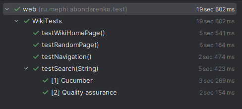
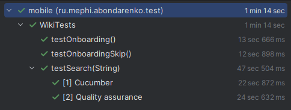
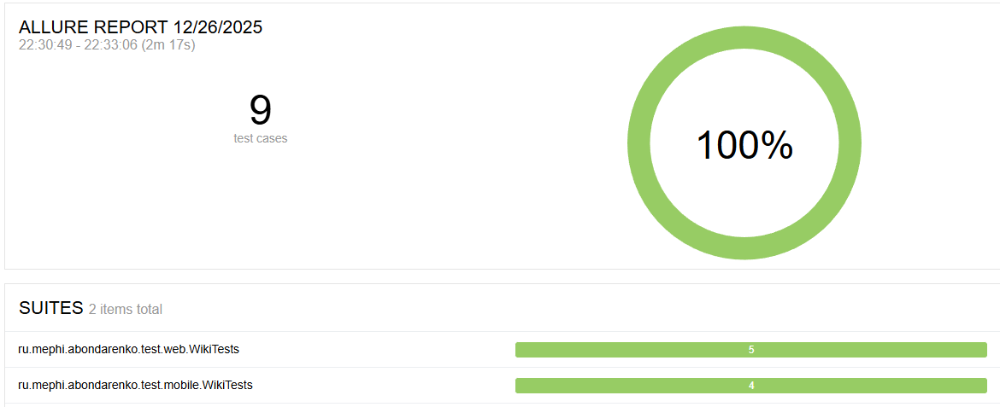
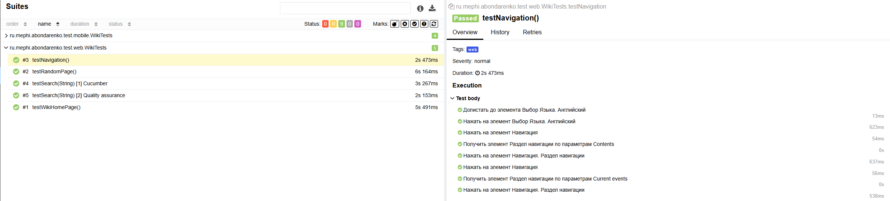
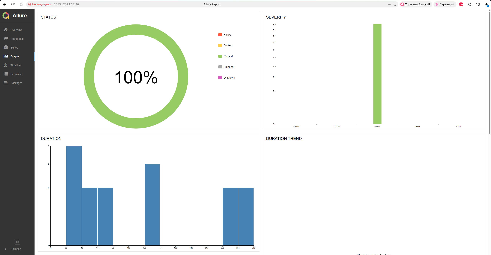

# mephi-qa-wiki-autotest

Учебный проект с автотестами для **Wikipedia**:
- **Web UI** тесты (Selenide + JUnit 5)
- **Mobile (Android)** тесты для приложения Wikipedia (Selenide Appium + Appium)

Отчётность: **Allure**.

---

## Стек

- Java **25**
- Maven
- JUnit 5
- Selenide / Selenide Appium
- Appium (для mobile)
- Allure (результаты + отчёты)

---

## Структура проекта
```
src
├── main
│   └── java
│       └── ru.mephi.abondarenko
│           └── model
│               └── PageElement
│
└── test
    └── java
        └── ru.mephi.abondarenko
            ├── data
            │   └── pages
            │       ├── mobile
            │       │   ├── HomePage
            │       │   ├── OnboardingPage
            │       │   └── SubjectPage
            │       └── web
            │           ├── WikiCorePage
            │           ├── WikiHomePage
            │           └── WikiSubjectPage
            │
            └── test
                ├── mobile
                │   ├── common
                │   │   ├── driver
                │   │   │   └── WikiAppAndroidDriver
                │   │   ├── extension
                │   │   │   └── LocalMobileTestExtension
                │   │   └── BaseWikiAndroidTest
                │   └── WikiTests
                │
                └── web
                    ├── common
                    │   └── BaseWebDriverTest
                    └── WikiTests
```

- `src/test/java/.../test/web` — web-тесты (тег `@Tag("web")`)
- `src/test/java/.../test/mobile` — mobile-тесты (тег `@Tag("mobile")`)
- `src/test/java/.../data/pages/...` — PageObject'ы
- `src/main/java/.../model/PageElement.java` — базовая обёртка над элементами

> Папка с APK **игнорируется git'ом**: `src/test/resources/mobile/android/apk/`

---

## Требования

### Для запуска web-тестов
1) **JDK 25** (важно: в `pom.xml` стоит `maven.compiler.source/target = 25`)
2) **Maven** (3.8+)
3) Установленный браузер (по умолчанию Selenide запускает **Chrome**)

### Для запуска mobile-тестов (Android)
Дополнительно к пунктам выше:
1) **Node.js** (16+)
2) **Appium** (2.x)
3) **Android SDK / Android Studio** (эмулятор или устройство)
4) APK приложения Wikipedia Alpha (см. ниже)

---

## Установка окружения

### 1) Java и Maven
Проверьте версии:
```bash
java -version
mvn -v
```
Если видите ошибку вида `release version 25 not supported` — поставьте JDK 25 или понизьте версии `maven.compiler.source/target` в `pom.xml` под ваш JDK.

### 2) Appium (нужно только для mobile)
Установите Appium:
```bash
npm i -g appium
appium -v
```

Проверьте, что Android SDK доступен и `adb` работает:
```bash
adb devices
```

---

## Подготовка APK для mobile-тестов

Драйвер ожидает APK по пути **в classpath**:

`src/test/resources/mobile/android/apk/wiki.apk`

Скопируйте файл в эту папку (папка игнорируется git'ом, это нормально).

Также в драйвере сейчас зашит UDID:
- `emulator-5554`

Если у вас другой эмулятор/устройство — поменяйте значение в файле:

`src/test/java/.../test/mobile/common/driver/WikiAppAndroidDriver.java`

---

## Запуск

### Запуск всех тестов
```
Важно! Запуск всех тестов одновременно невозможен, 
поскольку web и mobile тесты используют один драйвер Selenide, 
а он инициализируется при запуске сьюта.
Запускайте мобильные автотесты отдельно от веб.
```
### Запуск только web-тестов
Самый простой вариант — запуском конкретного класса:
```bash
mvn clean test -Dgroups=web
```


### Запуск только mobile-тестов
```bash
mvn clean test -Dgroups=web
```

> Для mobile-тестов Appium поднимается автоматически JUnit-расширением
> (`LocalMobileTestExtension`), поэтому отдельный запуск `appium` в терминале обычно не нужен.


---

## Allure-отчёт

После прогона тестов результаты лежат в:
- `target/allure-results`

Сгенерировать отчёт:
```bash
mvn allure:report
```

Открыть локально:
- `target/allure-report/index.html`

Или запустить временный сервер отчёта:
```bash
mvn allure:serve
```



---

## Частые проблемы

- **Appium не стартует / не находится**  
  Проверьте `appium -v`, установлен ли Node.js и права.

- **Не видит устройство/эмулятор**  
  `adb devices` должен показывать ваш девайс/эмулятор.  
  Если UDID отличается — обновите `setUdid(...)` в `WikiAppAndroidDriver`.

- **Не найден APK**  
  Убедитесь, что файл лежит по пути  
  `src/test/resources/mobile/android/apk/wiki.apk`

- **Проблемы с ChromeDriver**  
  Обновите Chrome или поставьте совместимую версию драйвера (обычно Selenium/Selenide подтягивает автоматически, но в некоторых окружениях нужен установленный Chrome).

---

## Полезные команды

- Запуск тестов с подробными логами Maven:
```bash
mvn -X clean test
```
